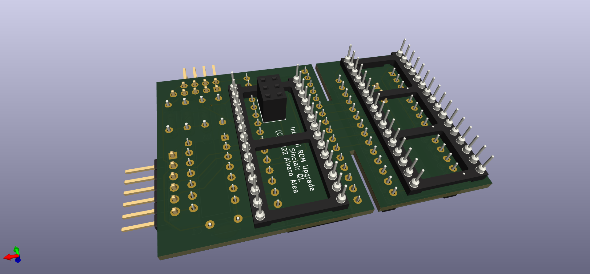

# SINCLAIR QL ROM Adapter with up to 8 Banks.

(C) 2024 Alvaro Alea Fernandez

License under: CERN Open Hardware Licence Version 2 - Strongly Reciprocal

https://ohwr.org/cern_ohl_s_v2.txt

MORE INFO WILL BE ADDED, SOON

## Intro

This board consist in 2 part (shall be 3, really)

A board that replace the 2 ROMS of the Sinclair QL. use a 39SF040 (512kb, 8x64kb, same chip that zx spectrum dandanator)

A board that allow to program the EEPROM Chip in a standar chip programmer.

A optional small board to glue in the outside of Sinclair QL (with dual side tape) and allow easy switch of the ROM

## Instructions

J2 shall have 3 jumper 1-2, 3-4 and 5-6 for normal use, remove the 3 jumpers to program the chip.

J1 pins 1-2 are to enable the top 16Kb of memory, normally with Toolkit II, remove to use the external ROM Cartridge slot (for QIMSI, MICE and others)
J1 pins 3-4,5-6 and 7-8 allow to select between 8 banks of ROM.
Remove all J1 jumpers to program the chip.

Insert the main board into the programer board, and insert both in the programer to program it.

